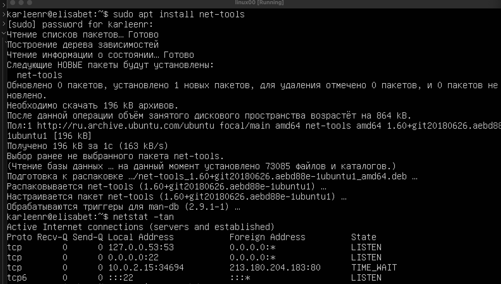

## Part 1. Installation of the OS
 Установил образ Ubuntu 20.04.6 
- Проверил версию Ubuntu, выполнив команду ```cat /etc/issue```


## Part 2. Creating a user
 Создал нового пользователя и добавил его в группу adm. Сперва нужно создать группу. Для этого использую команду ```sudo groupadd adm```
 
и уже после, создаю пользователя и сразу добавляю его в группу ```amd```

- Чтобы создать пользователя и сразу добавить его в группу, исользуем команду ```sudo useradd -m -G adm username``` 

-m: Создает домашнюю директорию для нового пользователя.
-G adm: Добавляет пользователя в группу adm, что   позволяет ему получать доступ к определенным административным функциям.

Я создал пользователя с именим elisabet


Проверяем, что пользователь создался и добавился ```cat /etc/passw``` 


## Part 3. Setting up the OS network

Установим имя машины user-1, используя команду ```sudo hostmanectl set-hostname user-1``` после убедимся, что имя изменилось

Установим часовой пояс, в котором я нахожусь командой ```sudo timedatectl set-timezone Europe/Moscow```. И проверим, вступили ли в силу изменения


Выведим имена сетевых интерфейсов с помощью команды ```ls```


Так же можно использовать команду ```ip a```

- Сетевой интерфейс ```io``` служит важной цели в контексте управления сетевыми данными и ресурсами в виртуализированных средах. Его присутствие позволяет улучшить производительность и управляемость системы, что особенно актуально для современных серверных и облачных решений.

С помощью консольной команды ```sudo dhclient -v enp0s3``` получил ip-адрес устройства от DHCP-сервера 

- DHCP (Dynamic Host Configuration Protocol) — это сетевой протокол, используемый для автоматического назначения IP-адресов и других параметров конфигурации сети устройствам, подключенным к сети. Он значительно упрощает процесс управления сетевыми настройками, позволяя избежать необходимости вручную настраивать каждый отдельный компьютер или устройство.


Определим и отобразим внешний IP-адрес шлюза (ip) и внутренний IP-адрес шлюза, также известный как IP-адрес по умолчанию (gw). 
- Командой ```ip route``` выведем defult ip-фдрес (gw)
- Командой ```curl ifconfig.me``` выведем внешний ip-адрес 


Установим статические (заданные вручную, а не полученные от DHCP-сервера) настройки IP, GW, DNS (используя публичные DNS-серверы, например, 1.1.1.1 или 8.8.8.8).

- Для этого через редактор ```nano``` откроем и изменим .yaml файл ```sudo nano /etc/netplan/00-installer-config.yaml```


- Сохраним наши изменения с помощью ```apply```

Теперь перезагрузим виртуальную машину с помощью команды ```sudo reboot``` и убедимся, что статические сетевые настройки (ip, gw, dns) соответсвуют заданным. 

Проверим это, выполнив команду ```ping ya.ru``` или ```ping 1.1.1.1```


## Part 4. OS Update

Обновим системные пакеты до последней версии с помощью команды ```sudo apt upadate && sudo apt upgrade```

Убедимся, что пакеты обновились, снова прописав эту команду 

## Part 5. Using the sudo command

- Команда sudo позволяет пользователям запускать программы от имени суперпользователя

Разрешил пользователю, которого создал в Part 2, использовать ```sudo```. Для разрешения пользователю fungusgr использовать команду "sudo" добавляем его в файл конфигурации sudoers командой ```sudo adduser fungusgr sudo```

После этого заходим на нашего пользователя и изменяем имя машины. После проверям внесенные изменения

## Part 6. Installing and configuring the time service

Вывел время часового пояса, в котором нахожус на данный момент командой ```timedatectl show```


## Part 7. Installing and using text editors

Установим текстовый редактор JOE. ```sudo apt install joe```. VIM и nano уже встроены в систему.


# VIM


 Создал текстовый файл с помощью команды ```vim test_vim.txt```, написал свой ник и вышел из редактора следующим путем:
 - ESC + : + wq
 
 поиск по слову происходит через слеш "/word"
 

 Чтобы заменить слово на другое, нужно использовать ```:s/пример/образец/```
 - %s первое вхождене
  
 - если нужно применить ко всем словам, то после последнего символа пишем флаг```g```

 # NANO 


Создал текстовый файл с помощью команды ```nano test_nano.txt``` , написал свой ник и вышел из редактора следующим путем:
- control + X + Y + Enter

- Чтобы отредактировать текст, ничего вводить не нужно. 

- Чтобы произвести поиск, нужно ввести комбинацию: control + W и ввести слово


- Чтобы заменить текст, нужно ввести комбинацию: 
- control + \  
- ввести текст, который необходимо заменить
- ввести текст, которым нужно заменить
- ввести Y 


# JOE 

Создал текстовый файл с помощью команды ```joe test_joe.txt``` , написал свой ник и вышел из редактора следующим путем: 

- control + K, а затем X

- Чтобы произвести поиск, нужно ввести комбинацию: control + R + F
и ввести слово


- Чтобы заменить текст, нужно ввести комбинацию: control + R + F
и ввести слово. После нахождения слова, чтобы заменить его, снова нажмите Ctrl + K, затем R (это для начала режима замены).


## Part 8. Installing and basic setup of the SSHD service

В терминале выполнил команду ```sudo apt install openssh-server``` Чтобы установить службу SSH (sshd).


После установки включаем автоматический запуск службы SSH при каждой загрузке системы. Для этого выполним команду ```sudo systemctl enable ssh```


Сбросим службу SSHd на порт 2022 с помощью ```sudo nano /etc/ssh/ssh_config``` и изменим Port 22 на Port 2022. Сохраним изменения и выйдем 


Перезапустите службу SSH для применения изменений следующей командой ```sudo systemctl restart ssh```

Используя команду ```ps -e | grep sshd``` вывел процесс sshd

ps: Это команда для отображения текущих процессов в системе.
aux:
- Набор ключей:
- a: Показывает процессы всех пользователей, а не только текущего.
- u: Выводит информацию о пользователе, который запустил процесс, и использование ресурсов (CPU и памяти).
- x: Показывает процессы, не привязанные к терминалу.
- |: Оператор конвейера, который передает вывод одной команды в качестве ввода для другой.
grep sshd: Фильтрует вывод команды ps, показывая только строки, содержащие "sshd". Это позволяет нам увидеть только процессы SSH-сервера.




Чтобы сделать вывод команды ```netstat -tan```, сперва нужно ее установить. 

- "tcp" - указывает на использование протокола TCP
- "tcp6" - указывает на использование протокола TCP с IPv4, и IPv6
- "0.0.0.0:2022" - адрес и порт, на котором слушает сервер
- "LISTEN" - состояние порта, в данном случае, служба ждет входящих соединений
- "0.0.0.0:*" - обозначает, что сервер принимает соединения на любом доступном интерфейсе для указанного порта

## Part 9. Installing and using the top, htop utilities


# TOP

Установим top и htop  ```sudo apt install htop```


После чего запустим top соответствующей командой 


После запуска команды top,  получаем следующую информацию:
- Время безотказной работы: 
отображается в верхней части вывода как up.
- Количество авторизованных пользователей: указано рядом с users.
- Средняя загрузка системы: представлена как load average за последние 1, 5 и 15 минут.
- Общее количество процессов: указано как Tasks total.
- Загрузка процессора: отображается в процентах под заголовком CPU.
- Загрузка памяти: отображается в процентах под заголовком Mem.
- PID процесса с наибольшим использованием памяти: можно определить, отсортировав процессы по памяти (нажмите M).
- PID процесса, потребляющего больше всего процессорного времени: можно определить, отсортировав процессы по времени (нажмите T).

# HTOP

После запуска htop видим следующее 


Чтобы отсортировать нужно нажать F6 

Чтобы использовать функцию поиска для фильтрации нужно нажать F3
Процесс syslog, найденный, через поиск (F3)

Добавил в шапку вывод hostname, clock и uptime (F2)


## Part 10. Using the fdisk utility

Запустил команду ```fdisk -l``` и вывел данные по накопителю


Название VBOX HARDDISK.
Размер 5,61 GiB.
Кол-во секторов 11744051.
Подкачик у меня нет. 

## Part 11. Using the df utility

Запустил команду ```df```

- Размер размера 3885912 kb
- Занято 2817844 kb
- Свободно 850164 kb
- % Занятости 77 %

Запустил команду ```df -Th```

- Размер раздела 3,8 Gb 
- Занято 2,7 Gb
- Свободно 831 M
- % Занятости 77 %

ext4 - это одна из наиболее распространенных расширенных файловых систем 4-го поколения для Linux
Она поддерживает большие объемы файлов и размеров дисков, журналируется для обеспечения целостности данных и обладает хорошей производительностью

Использованные ключи команды df: -t, -T или --type: выводит информацию только про указанные файловые системы
-h: выводит размер файлов в человекочитаемом виде

## Part 12. Using the du utility

Запустил команду ```du```


Используем команду du с ключами -b для вывода размера в байтах и -s для суммарного размера:

```sudo du -sb /home /var && sudo du -s /var/log```

Чтобы вывести размер каждого элемента используем команду ```sudo du -h * /var/log```

-h (для удобного формата) и * для отображения всех элементов

## Part 13. Installing and using the ncdu utility

Установим утилиту ncdu (NCurses Disk Usage)

Выведем размер home ```sudo ncdu /home```

Выведем размер var 
```sudo ncdu /var```

Выведем размер log в var 
```sudo ncdu /var/log```

## Part 14. Working with system logs

Открою для просмотра, с помощью команды ```less```
1. /var/log/dmesg
2. /var/log/syslog
3. /var/log/auth.log


Нашел дату и время последней авторизации, имя пользователя и метод входа.

Для перезапуска службы SSHd выполним следующую команду ```sudo systemctl restart sshd``` и  ```journalctl -t sshd```
посмотрим сообщение о перезапуске службы 


journalctl - это утилита в системе systemd, предназначенная для просмотра и анализа журналов системы.

## Part 15. Using the CRON job scheduler

Используя планировщик заданий, нужно запускать команду uptime каждые 2 минуты. Для этого испрльзуем команду ```crontab -e``` для редактирования и добавим строчку ```*/2 * * * * uptime```


Проверил статус службы командой ```systemctl status cron```


Нашёл в системных журналах четыре строчки о выполнении командой ```journalctl -u cron```


Вывел на экран список текущих заданий для CRON командой ```crontab -l```
Удалил все задания из планировщика заданий командой ```crontab -r```
Убедился, что список заданий удалён
